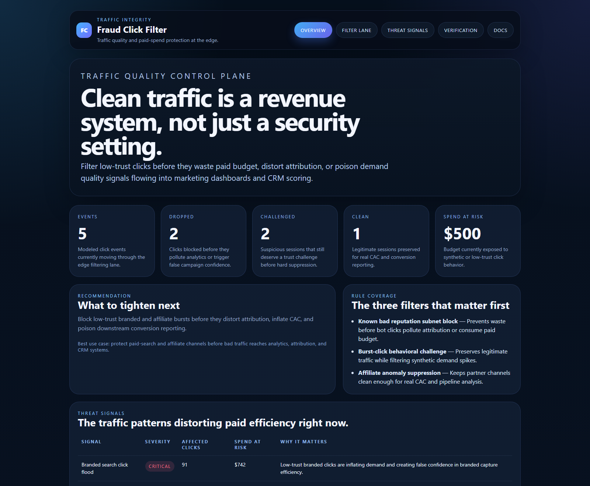
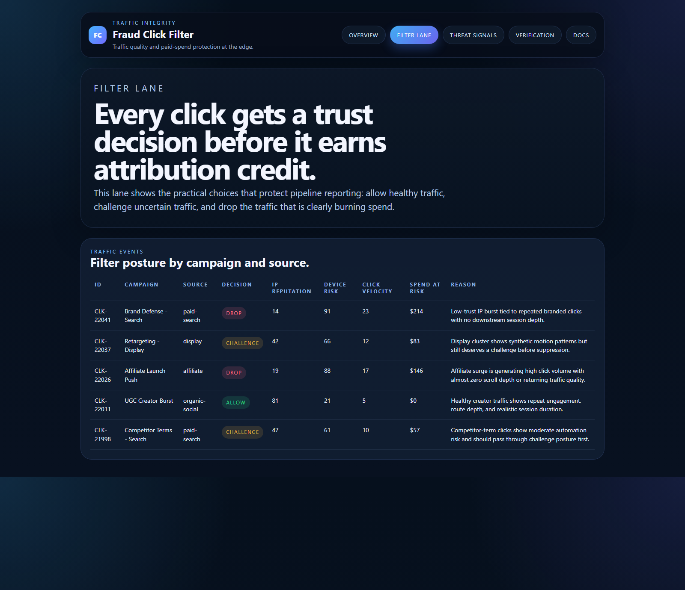
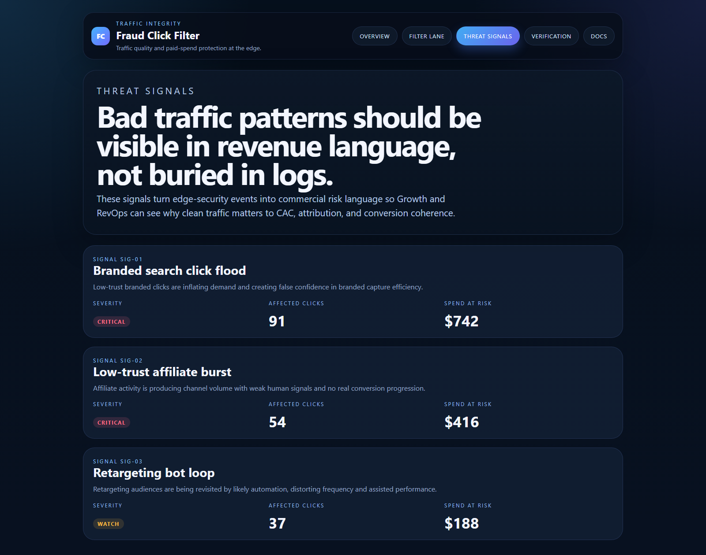
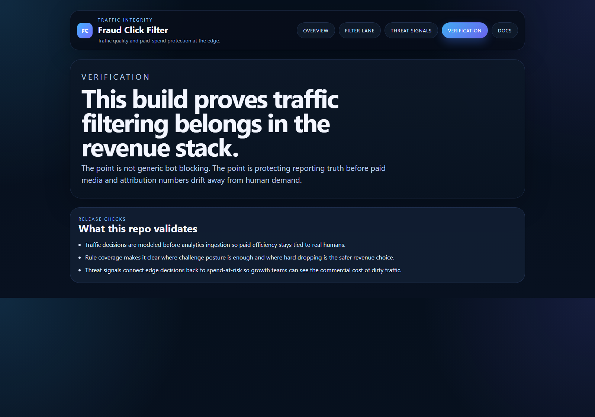

# Fraud Click Filter

TypeScript control plane for filtering fraudulent or low-trust clicks before they pollute analytics, attribution, and paid-efficiency reporting.

## Why this exists

Traffic quality is usually treated like a security problem after the damage is already in the dashboards. By then:
- paid campaigns look healthier than they really are
- attribution models start giving credit to synthetic demand
- affiliate and retargeting channels absorb spend without earning real pipeline
- Growth and RevOps teams make commercial decisions on dirty traffic

`fraud-click-filter` models the traffic-integrity layer early enough to protect revenue reporting before bad clicks become fake performance.

## Routes

- `/`
- `/filter-lane`
- `/threat-signals`
- `/verification`
- `/docs`

## API

- `/api/dashboard/summary`
- `/api/filter-lane`
- `/api/rules`
- `/api/threat-signals`
- `/api/verification`
- `/api/sample`

## Screenshots






## Local Development

```powershell
cd fraud-click-filter
npm install
npm run dev
```

Open:
- [http://127.0.0.1:5262/](http://127.0.0.1:5262/)
- [http://127.0.0.1:5262/filter-lane](http://127.0.0.1:5262/filter-lane)
- [http://127.0.0.1:5262/threat-signals](http://127.0.0.1:5262/threat-signals)
- [http://127.0.0.1:5262/verification](http://127.0.0.1:5262/verification)
- [http://127.0.0.1:5262/docs](http://127.0.0.1:5262/docs)

## Validation

- `npm run build`
- `npm run test`
- `npm run demo`
- `npm run smoke`
- `npm run render:assets`

## Docs

- [Architecture](./docs/architecture.md)
- [Origin](./docs/ORIGIN.md)
- [Changelog](./CHANGELOG.md)
